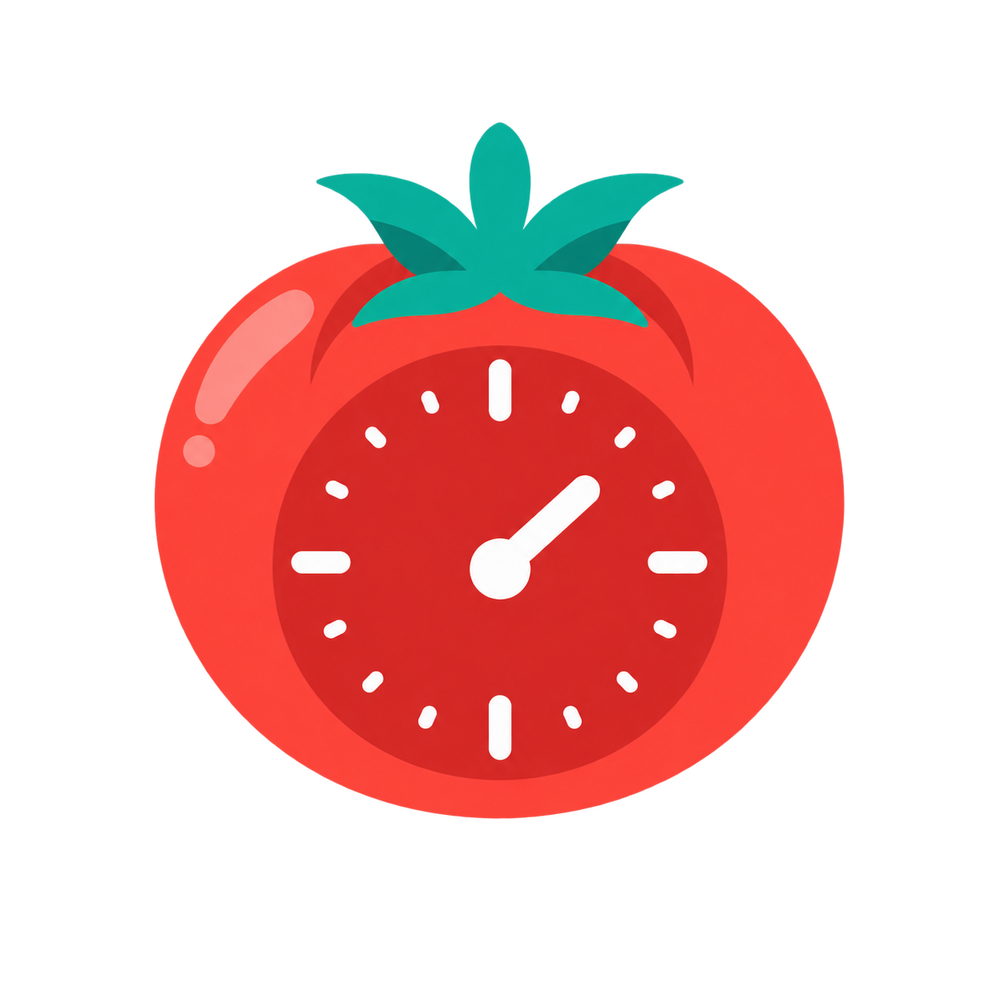

# Pomodoro Pro

<p align="center">
  
</p>

<p align="center">
  Temporizador Pomodoro multiplataforma creado con Flutter y Riverpod para organizar sesiones de concentración, descansos y objetivos diarios.
</p>

<p align="center">
  <a href="https://github.com/Mati-dubs-dev/pomodoro-flutter-app/actions/workflows/ci.yml"></a>
  <a href="LICENSE"></a>
  
  
</p>

## Descripción

Pomodoro Pro ayuda a trabajar en intervalos de concentración y descanso sin depender de una cuenta ni de servicios externos. Cada sesión puede asociarse a una tarea, el temporizador se recupera al volver a abrir la aplicación y las estadísticas permanecen almacenadas localmente.

El proyecto está preparado para Android, iOS, web, Windows, macOS y Linux. Las funciones relacionadas con notificaciones dependen de las capacidades y permisos de cada plataforma.

## Características

- Modos de concentración, descanso corto y descanso largo.
- Duraciones, objetivo diario y ciclos configurables.
- Tarea o intención asociada a cada sesión de concentración.
- Pausa, reanudación, reinicio, salto y extensión de cinco minutos.
- Restauración del temporizador después de cerrar la aplicación.
- Reconciliación de sesiones finalizadas mientras la aplicación estaba cerrada.
- Notificaciones locales programadas en Android, iOS y macOS.
- Controles independientes para sonido, vibración y notificaciones.
- Inicio automático opcional de descansos y sesiones de concentración.
- Historial local editable con hasta 300 sesiones.
- Estadísticas diarias y semanales, racha, mejor día y distribución por tarea.
- Interfaz adaptable a pantallas compactas y de escritorio.
- Etiquetas semánticas y anuncios para tecnologías de asistencia.
- Tema visual e iconos propios de Pomodoro Pro.

## Tecnologías principales

- Flutter y Dart para la interfaz multiplataforma.
- Riverpod para estado y composición de dependencias.
- SharedPreferences para persistencia local.
- flutter_local_notifications y timezone para recordatorios del sistema.
- flutter_test para pruebas unitarias y de widgets.
- GitHub Actions para formato, análisis, pruebas y compilación web.

## Requisitos

- Flutter 3.47.1 o una versión estable compatible.
- Dart 3.11.4 o posterior, según `pubspec.yaml`.
- Android Studio y Android SDK para Android.
- Xcode y CocoaPods en macOS para iOS y macOS.
- Visual Studio con la carga de trabajo de C++ para Windows.
- Chrome para ejecutar la versión web.

Comprueba tu entorno antes de comenzar:

```bash
flutter doctor -v
```

## Instalación

1. Clona el repositorio.

   ```bash
   git clone https://github.com/Mati-dubs-dev/pomodoro-flutter-app.git
   cd pomodoro-flutter-app
   ```

2. Instala las dependencias.

   ```bash
   flutter pub get
   ```

3. Consulta los dispositivos disponibles y ejecuta la aplicación.

   ```bash
   flutter devices
   flutter run
   ```

Puedes elegir un destino explícito con `flutter run -d chrome`, `flutter run -d windows` o el identificador de un emulador o dispositivo.

> `flutter pub get` debe ejecutarse dentro de esta carpeta, donde se encuentra `pubspec.yaml`. Si aparece `No pubspec.yaml file found`, verifica el directorio actual con `pwd` o `Get-Location`.

## Comandos útiles

```bash
# Formato, análisis y pruebas
dart format --output=none --set-exit-if-changed lib test
flutter analyze
flutter test

# Cobertura
flutter test --coverage

# Artefactos de producción
flutter build apk --release
flutter build appbundle --release
flutter build web --release
flutter build windows --release
```

Las compilaciones de iOS y macOS deben realizarse en macOS. La firma y las credenciales de las tiendas no están incluidas en el repositorio.

## Arquitectura

El proyecto usa una separación sencilla por responsabilidades:

```text
lib/
├── models/       Entidades persistidas y modos del temporizador
├── providers/    Estado, reglas de negocio y métricas derivadas
├── screens/      Pantallas principales de la aplicación
├── services/     Temporizador, almacenamiento, audio y notificaciones
├── utils/        Formateadores y utilidades puras
├── widgets/      Componentes visuales reutilizables
└── main.dart     Inicialización e inyección de servicios
```

```text
Interfaz → PomodoroNotifier → TimerService
                         ├── StorageService
                         ├── NotificationService
                         ├── AudioService
                         └── HapticService
```

`PomodoroNotifier` concentra las reglas de la sesión. `TimerService` calcula el tiempo restante a partir de una hora de finalización, evitando depender únicamente del número de ticks. `StorageService` conserva el snapshot del temporizador, preferencias, estadísticas e historial. Los servicios se inyectan mediante providers para facilitar las pruebas con dobles controlados.

Consulta [docs/ARCHITECTURE.md](docs/ARCHITECTURE.md) para conocer el flujo, los modelos persistidos y los puntos de extensión.

## Persistencia y privacidad

Todos los datos funcionales se almacenan en el dispositivo mediante SharedPreferences. El proyecto no incluye autenticación, analítica, publicidad, seguimiento ni sincronización en la nube.

Se conservan preferencias, el estado del temporizador, estadísticas de hasta 90 días, hasta 300 sesiones individuales y el texto de las tareas. Desinstalar la aplicación o borrar sus datos elimina esta información.

## Notificaciones

Android solicita permiso para notificaciones y, cuando corresponde, para alarmas exactas. Si una alarma exacta no está disponible, utiliza una programación inexacta. iOS y macOS solicitan autorización mediante sus APIs del sistema.

En web, Windows y Linux el temporizador funciona, pero la implementación actual no programa notificaciones locales del sistema. Las pruebas de suspensión, cierre forzado, reinicio y cambio de fecha deben realizarse en dispositivos reales antes de publicar.

## Pruebas

La suite cubre cambio de día, historial, restauración de temporizadores activos y pausados, reconciliación de sesiones vencidas, preferencias de audio y notificaciones, y comportamiento en pantallas compactas.

Los dobles están en `test/support/fakes.dart`. Al modificar reglas del temporizador o persistencia, añade el caso correspondiente y evita utilizar esperas reales en los tests.

## Generación de iconos

El archivo fuente está en `assets/app_icon.png`. Para regenerar los iconos:

```bash
dart run flutter_launcher_icons
```

## Cómo contribuir

Las contribuciones son bienvenidas: correcciones, accesibilidad, pruebas, traducciones y nuevas funciones.

1. Lee [CONTRIBUTING.md](CONTRIBUTING.md).
2. Busca un issue existente o abre uno describiendo la propuesta.
3. Crea una rama desde `main`.
4. Mantén cada pull request enfocado en un solo objetivo.
5. Ejecuta formato, análisis y pruebas antes de enviarlo.

Al participar aceptas el [Código de conducta](CODE_OF_CONDUCT.md). Los problemas de seguridad deben comunicarse siguiendo [SECURITY.md](SECURITY.md), no mediante un issue público.

## Publicación

Antes de crear una versión consulta [docs/RELEASE_CHECKLIST.md](docs/RELEASE_CHECKLIST.md). Incluye validaciones automáticas, pruebas reales, permisos, firma, privacidad, versión y despliegue gradual.

## Ideas para futuras contribuciones

- Internacionalización completa con ARB.
- Exportación e importación del historial.
- Sincronización opcional entre dispositivos.
- Notificaciones nativas para Windows y Linux.
- Más pruebas de integración y golden tests.
- Distribución automatizada de versiones firmadas.

## Licencia

Distribuido bajo la licencia MIT. Consulta [LICENSE](LICENSE).

## Autor

Creado y mantenido por [Mati-dubs-dev](https://github.com/Mati-dubs-dev).
